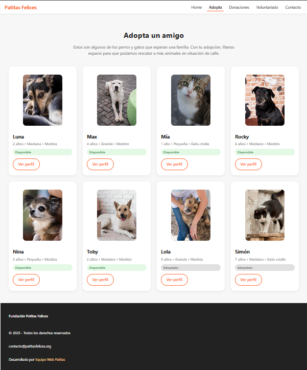
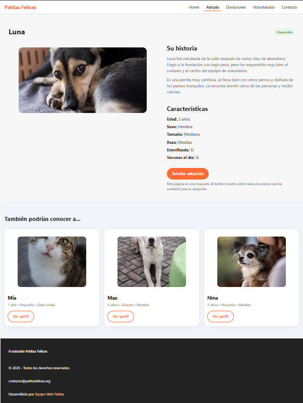

# Fundación Patitas Felices – Maqueta Web (HTML + CSS)

Maqueta web estática para la Fundación Patitas Felices, cuyo objetivo es visibilizar el trabajo de rescate, cuidado y
reubicación de animales, así como facilitar el acceso a la información sobre adopciones, donaciones, voluntariado y
contacto.

## Tecnologías utilizadas

- HTML5
- CSS3 (sin frameworks externos)
- Diseño responsive con 3 breakpoints principales:
  - Mobile: ≤ 600px
  - Tablet: 601px – 1023px
  - Desktop: ≥ 1024px

## Instrucciones de ejecución

1. Descarga o clona este repositorio.
2. Abre la carpeta del proyecto.
3. Haz doble clic en `index.html` para abrirlo en tu navegador.
4. Navega entre las páginas usando el menú superior.

Opcional:
- Puedes usar la extensión *Live Server* de Visual Studio Code para recargar los cambios automáticamente mientras editas.

## Capturas de pantalla

### Home (Vista Desktop)


### Adopta (Vista Desktop)


### Perfil de Animal (Vista Desktop)


### Contacto (Vista Mobile)


## Estructura de carpetas

```text
.
├── index.html
├── adopta.html
├── perfil-animal.html
├── contacto.html
├── css/
│   └── styles.css
├── assets/
│   ├── img/
│   └── wireframes/
└── README.md

